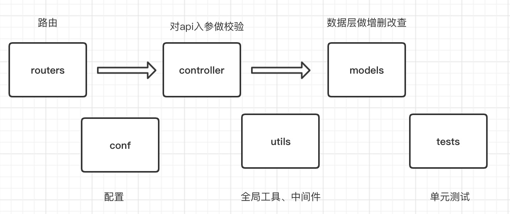

### 首页
#### ① 缓存热门数据：
用redis string类型来存储。模块首页数据直接进缓存，读取的时候直接返string。

#### ② 商品被浏览的次数：

用redis hash类型来记录。 key取名举例:glance_at_clothes、glance_at_shoes (根据商品类型划分多个key出来) 

子key-商品id value-被浏览的次数  

在商品首页路由对应的控制器函数中调用redis的hash类型单个子key递增函数hincrby，商品每被浏览一次，递增1

#### ③ 商品榜单：

用redis zset类型来记录。可用不同的key来分别记录不同商品类型的热门数据。

score是商品的浏览次数，value是商品id。利用score逆序可轻松读取出热门商品列表。

#### ④ 置顶功能：

用redis string类型来记录。可用不同的key来分别记录不同商品类型的置顶数据(每个类型只有1份置顶数据)。value放json。

列表数据查询的时候，查2个key拼接数据来给出response：redis置顶数据+redis列表页数据(列表页没有就访问mysql)

### 发现
#### ① 点赞：

用redis set类型来记录。value放用户id。set用于去重

#### ② 评论：

用redis zset类型来记录。score设置为用户评论的时间戳，value为评论id。

利用有序集合数据类型即可有序读取出对该条讯息所有的用户评论的次序。

等用户点击评论按钮要查看评论时，查询操作如下：

调用zrange函数来取出上一步存储的zset对应分页的评论id，再进一步根据评论id查询出对应的评论内容和用户信息(优先查询缓存)

#### ③ 相关推荐：

用redis list类型来记录。可以用额外的程序来设置这份缓存，查询的时候直接查redis。

### 更多
### ① 用户收藏的商品：

用redis zset类型来记录。score设置为用户收藏的时间戳，value为商品id。

利用有序集合数据类型即可方便有序读取出用户收藏的商品。

